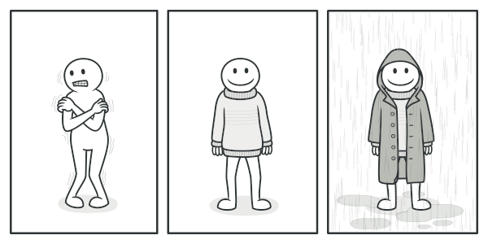

# Decorator Design Pattern
>is used to dynamically extend or even change the behavior of an object during run-time. The effect might seem a lot like class inheritance, but this pattern allows you to switch between behaviors during the same execution, which is something inheritance does not. 
>Decorator is a structural pattern that consists of dynamically augmenting the behavior of an existing object. It's different from classical inheritance, because the behavior is not added to all the objects of the same class, but only to the instances that are explicitly decorated. 
>Implementation-wise, it is very similar to the Proxy pattern, but instead of enhancing or modifying the behavior of the existing interface of an object, it augments it with new functionalities.

## More Info
Although Proxy and Decorator are conceptually two different patterns with different intents, they practically share the same implementation strategies.

## Example
3 different decorator example use cases are in their files

## See This For Better Understanding:

