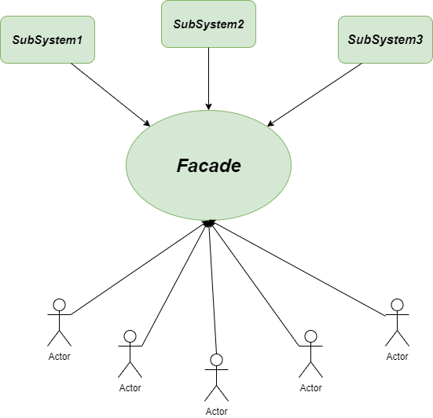

# Facade Design Pattern
>The facade pattern aims to provide a simplified way to interact with multiple components by creating a single API. By masking the underlying interactions, it helps us to keep our code more readable.
>The facade pattern can also help us to group generic functionalities into a more specific context. It is especially useful in situations when our system is quite complex, and we can see some patterns in the way we interact with it.

## Best Practice
- There is a complex system and you need a simple interface to communicate with it.
- The code is tightly coupled due to the clients need a wide knowdlege about the system. The Facade pattern allows reduce the coupled between components.
- The system need an entry point to each level of layered software.

## See This For Better Understanding:

