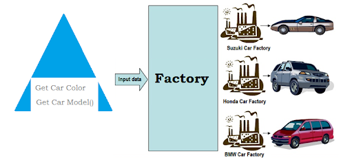

# Factory Design Pattern
>A factory’s job is to create objects so that you don’t have to, which can be advantageous for several reasons. If you are creating a public module to share on npm or even privately within your own team, adding a factory interface can make your module easier to work with. This is especially true if setup requires additional steps after calling the constructor. 
>can consolidate and standardize on all of this custom-creation for both you and your users, dictating exactly how new objects should be created. 
>If you find yourself struggling with complex object creation across multiple parts of your application, this pattern could be the answer. By centralizing this logic in a single place, you keep it from spreading across the rest of your code base where it shouldn’t belong.

More Info: http://thenodeway.io/posts/designing-factories/

## See This For Better Understanding:

