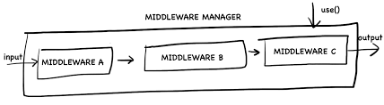

# Middleware Design Pattern
>The middleware is called as a chain of functions, with order based on middleware definition order(time) with matching routes (if applicable).
Taking in account that req and res objects are travelling through chain so you can reuse/improve/modify data in them along the chain.

>There are two general use cases for middleware: generic and specific.
Generic is as you have defined in example above: app.use, it will apply to every single request. Each middleware have to call next() inside, if it wants to proceed to next middleware.
When you use app.get('/path', function(... this actual function is middleware as well, just inline defined. So it is sort of fully based on middlewares, and there is no endware :D
The chain order is based on definition order. So it is important to define middleware in sync manner or order-reliable async manner. Otherwise different order of middleware can break logic, when chain of middleware depends on each other.

## use cases
Some middleware can be used to break the chain return next(new Error());. It is useful for example for validation or authentication middleware.
Another useful pattern of use for middleware is to process and parse request data, like cookies, or good example of such app.use(express.bodyParser());

## example
The json middleware that we just created is very simple: 
- The inbound middleware deserializes the message received as an input and assigns the result back to the data property of message, so that it can be further processed along the pipeline 
- The outbound middleware serializes any data found into message.data

## See This For Better Understanding:

