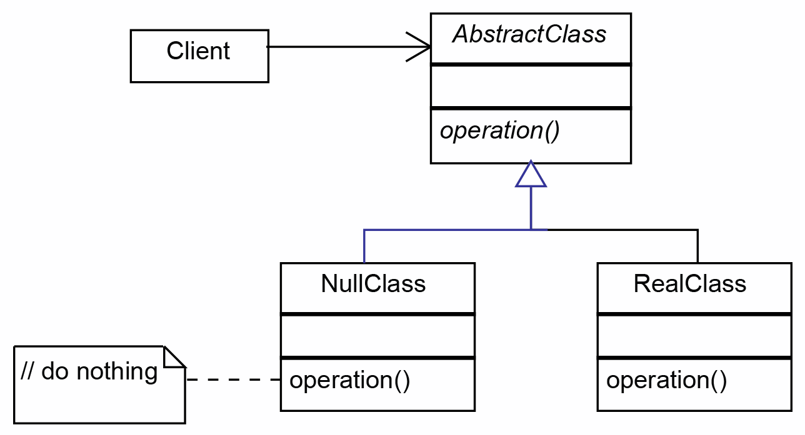

# Null Design Pattern
>The Null Object Design Pattern wraps up the null into its own object. Instead of having a null reference for some object, we wrap it into a NULL version of that object which will implement the same interface that of the object, i.e. same methods and properties.
>The intent of a NULL OBJECT is to encapsulate the absence of an object by providing a substitutable alternative that offers suitable default do-nothing-behavior. In short, a design where “nothing will come of nothing”.

## Examples
We often get a situation where we have to check if an object exists and then we need to get its properties/methods. This kind of code gets messy very easily in medium to large scale applications repeating itself all over the codebase.

## See This For Better Understanding:
