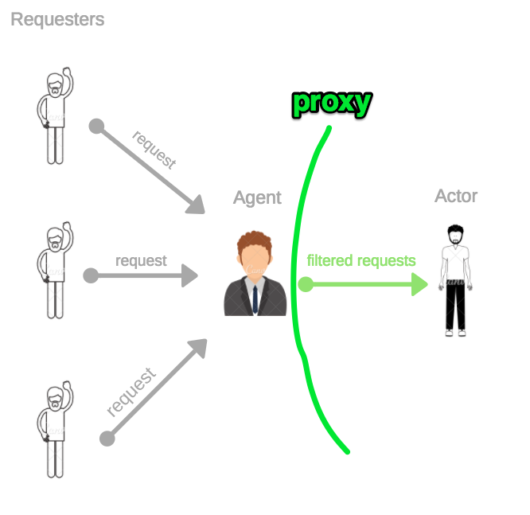

# Module Design Pattern
>A proxy is an object that controls access to another object, called subject. Both have identical interface and this allows us to transparently swap one for the other.
> A proxy intercepts all or some of the operations that are meant to be executed on the subject, modifying their behavior.
> helps us deal with a proxy object and talk to the actual object.

## More Info
- Proxy pattern helps us create wrapper for object that allows external access control to the object.
- Proxy API (ES2015, NodeJs v6+) has Proxy API that enables creation of proxy.
- Proxy implements various useful traps for property access.
- This pattern is good for implementing middleware mechanism for caching, logging, encryption or other kinds of augmented functionality.

## Use Cases
- A proxy is useful in several circumstances, for example, consider the following ones:

- Data validation: The proxy validates the input before forwarding it to the subject

- Security: The proxy verifies that the client is authorized to perform the operation and it passes the request to the subject only if the outcome of the check is positive

- Caching: The proxy keeps an internal cache so that the operations are executed on the subject only if the data is not yet present in the cache

- Lazy initialization: If the creation of the subject is expensive, the proxy can delay it to when it’s really necessary

- Logging: The proxy intercepts the method invocations and the relative parameters, recoding them as they happen

- Remote objects: A proxy can take an object that is located remotely, and make it appear local

## Example
example 1 is about Bank 
example 2 is with proxy API 

More info: https://grokonez.com/node-js/ways-to-implement-proxy-pattern-in-node-js

## See This For Better Understanding:

