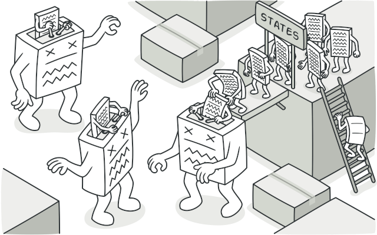

# State Design Pattern
>State is a variation of the Strategy pattern where the strategy changes depending on the state of the context. 

>we see (read Strategy pattern before) how a strategy can be selected based on different variables such as user preferences, a configuration parameter, and the input provided, and once this selection is done, the strategy stays unchanged for the rest of the lifespan of the context.
 Instead, in the State pattern, the strategy (also called state in this circumstance) is dynamic and can change during the lifetime of the context, thus allowing its behavior to adapt depending on its internal state.

## Example
Our server simply prints any JSON message it receives to the console, while our clients are sending a measurement of their memory utilization every second, leveraging a FailsafeSocket object. To try the small system that we built, we should run both the client and the server, then we can test the features of failsafeSocket by stopping and then restarting the server. We should see that the state of the client changes between online and offline and that any memory measurement collected while the server is offline is queued and then resent as soon as the server goes back online. This sample should be a clear demonstration of how the State pattern can help increase the modularity and readability of a component that has to adapt its behavior depending on its state.

## See This For Better Understanding:

