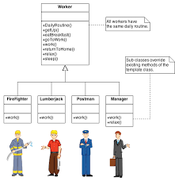

# Template Design Pattern
> Template consists of defining an abstract pseudo class that represents the skeleton of an algorithm, where some of its steps are left undefined.
>Subclasses can then fill the gaps in the algorithm by implementing the missing steps, called template methods. The intent of this pattern is to make it possible to define a family of classes that are all variations of a similar algorithm.

## More Info
The purpose of Template and Strategy is very similar, but the main difference between the two lies in their structure and implementation. Both allow us to change some parts of an algorithm while reusing the common parts; however, while Strategy allows us to do it dynamically and possibly at runtime, with Template the complete algorithm is determined the moment the concrete class is defined. Under these assumptions, the Template pattern might be more suitable in those circumstances where we want to create prepackaged variations of an algorithm. As always, the choice between one pattern and the other is up to the developer, who has to consider the various pros and cons for each use case.

## See This For Better Understanding:

